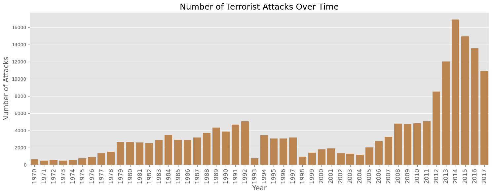

# Terrorism Fatalities and their Influencing Factors
## Background:
Terrorism is defined as the deliberate targeting of victims whose deaths and injuries are expected to weaken the opponent’s will to persist in a political conflict. To be considered an act of terrorism, an action must be violent, or threaten violence, often to terrorize a population or government for certain political, religious or ideological purpose. Hence,  political dissent, activism, and nonviolent resistance do not constitute terrorism. 
Following the 9/11 attacks, research to study terrorism and militant groups increased dramatically with a desire to uncover unique characteristics of its distribution, evolution, and execution of often radical ideas. In today’s vastly interconnected world, advances in communications and information technology have facilitated worldwide terrorist operations. For this analysis, terrorism is defined with these three criteria:
* Criterion 1: Aimed at attaining a political, economic, religious, or social goal. 
* Criterion 2: Intention to coerce, intimidate, or convey some other message to a larger audience
* Criterion 3: Must be outside the context of legitimate warfare activities. 

## Data:

This data is obtained from The Global Terrorism Database (GTD) at the University of Maryland. It records terrorist attacks around the world from 1970 through 2017. There are over 181,000 records and 135 columns such as date, location, number killed, number wounded, attack type, and target type.

* Includes information on more than 75,000 bombings, 17,000 assassinations, and 9,000 kidnappings since 1970
* Includes information on at least 45 variables for each case, with more recent incidents including information on more than 120 variables
* Over 4,000,000 news articles and 25,000 news sources were reviewed to collect incident data from 1998 to 2015 alone

When looking at this data and its 135 columns, many variables are left empty such as, whether there was a property damage, or are only included in more recent years. Since the data set is so large, I want to focus on terrorist attacks with a minimum number of deaths. For example, when I filter the data to attacks with one or more deaths, the results decrease more than half to just over 80,000. Additionally, the data from the year 1993 was not included in the large dataset. Instead, I had to import the 1993 data directly and merge it with the home data. For my research, I selected the columns most relevant towards my analysis and renamed them in a new data frame. 

| Event_ID    | Year | Month | Day | Country       | Region         | AttackType        | Target                | Fatalities | Wounded | Summary                                           | Group   | Target_Type         | Weapon_Type | Motive |
|-------------|------|-------|-----|---------------|----------------|-------------------|-----------------------|------------|---------|---------------------------------------------------|---------|---------------------|-------------|--------|
| 1.97001E+11 | 1970 | 1     | 2   | United States | North America  | Bombing/Explosion | Edes Substation       | 0          | 0       | 1/2/1970: Unknown perpetrators detonated explo... | Black Nationalists | Utilities           | Explosives  | NaN    |
| 1.97001E+11 | 1970 | 1     | 8   | Italy         | Western Europe | Hijacking         | Flight 802 Boeing 707 | 0          | 3       | NaN                                               | Unknown | Airports & Aircraft | Firearms    | NaN    |

## Approach and Goal:
* Explore how the amount of people killed are influenced by country/region, target, and attack type

| Country                     | Fatalities |
|-----------------------------|------------|
| Iraq                        | 78591      |
| Afghanistan                 | 39384      |
| Pakistan                    | 23849      |
| Nigeria                     | 22682      |
| India                       | 19865      |
