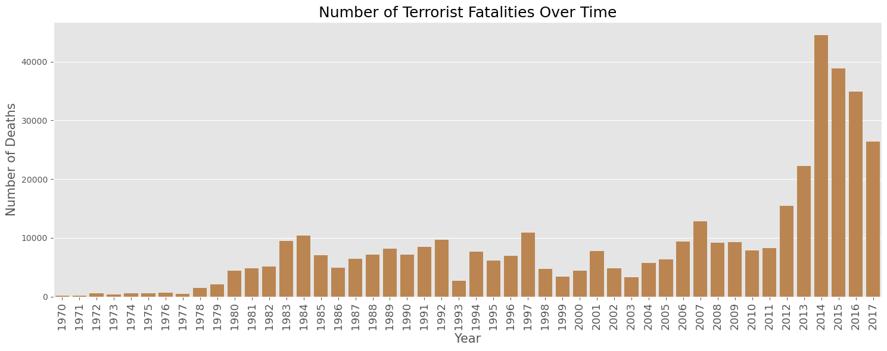

# Terrorism Fatalities and their Influencing Factors
## Background:
Terrorism is defined as the deliberate targeting of victims whose deaths and injuries are expected to weaken the opponent’s will to persist in a political conflict. To be considered an act of terrorism, an action must be violent, or threaten violence, often to terrorize a population or government for certain political, religious or ideological purpose. Hence,  political dissent, activism, and nonviolent resistance do not constitute terrorism. 
Following the 9/11 attacks, research to study terrorism and militant groups increased dramatically with a desire to uncover unique characteristics of its distribution, evolution, and execution of often radical ideas. In today’s vastly interconnected world, advances in communications and information technology have facilitated worldwide terrorist operations. For this analysis, terrorism is defined with these three criteria:
* Criterion 1: Aimed at attaining a political, economic, religious, or social goal. 
* Criterion 2: Intention to coerce, intimidate, or convey some other message to a larger audience
* Criterion 3: Must be outside the context of legitimate warfare activities. 

## Data:

This data is obtained from The Global Terrorism Database [(GTD)](https://start.umd.edu/gtd/) at the University of Maryland. It records terrorist attacks around the world from 1970 through 2017. There are over 183,000 records and 135 columns such as date, location, number killed, number wounded, attack type, and target type.

* Includes information on more than 75,000 bombings, 17,000 assassinations, and 9,000 kidnappings since 1970
* Includes information on at least 45 variables for each case, with more recent incidents including information on more than 120 variables
* Over 4,000,000 news articles and 25,000 news sources were reviewed to collect incident data from 1998 to 2015 alone

When looking at this data and its 135 columns, many variables are left empty such as, whether there was a property damage, or are only included in more recent years. Since the data set is so large, I want to focus on terrorist attacks with a minimum number of deaths. For example, when I filter the data to attacks with one or more deaths, the results decrease more than half to just over 80,000. Additionally, the data from the year 1993 was not included in the large dataset. Instead, I had to import the 1993 data directly and merge it with the home data. For my research, I selected the columns most relevant towards my analysis and renamed them in a new data frame. The table below shows my sorted and filtered dataframe.

| Event_ID    | Year | Month | Day | Country       | Region         | AttackType        | Target                | Fatalities | Wounded | Summary                                           | Group   | Target_Type         | Weapon_Type | Motive |
|-------------|------|-------|-----|---------------|----------------|-------------------|-----------------------|------------|---------|---------------------------------------------------|---------|---------------------|-------------|--------|
| 1.97001E+11 | 1970 | 1     | 2   | United States | North America  | Bombing/Explosion | Edes Substation       | 0          | 0       | 1/2/1970: Unknown perpetrators detonated explo... | Black Nationalists | Utilities           | Explosives  | NaN    |
| 1.97001E+11 | 1970 | 1     | 8   | Italy         | Western Europe | Hijacking         | Flight 802 Boeing 707 | 0          | 3       | NaN                                               | Unknown | Airports & Aircraft | Firearms    | NaN    |

## Approach and Goal:
* Explore how the amount of people killed are influenced by country/region, target, and attack type

**_Figures 1 & 2: Number of attacks and number of deaths from 1970 to 2017_**

Here, we can see both deaths and attacks have been increasing over time, with both peaking in 2014. Additionally, both rose sharply after 2010. However we do see some decline in recent years. After analysing the dataset and conducting outside research, the decrease in both activities and fatalities is credited toward the improving situation in Iraq and success in fighting ISIS and Boko Haram. In total, there have been over 414,000 documented deaths from terrorism.

| Country                     | Fatalities |
|-----------------------------|------------|
| Iraq                        | 78591      |
| Afghanistan                 | 39384      |
| Pakistan                    | 23849      |
| Nigeria                     | 22682      |
| India                       | 19865      |

### Top 20 Countries with the Highest Terrorism Fatalities

**_Figure 3: Folium Countries by Top Fatalities_**

Iraq has the highest fatalities of terrorist attacks by a significant margin, almost double that of Afganistan. Countries such as Iraq and Afganistan have experienced recent massive increases, while others have a long history, such as India and Pakistan.

### Fatalities Breakdown

**_Figures 4 & 5: Regions by Top Fatalities_**

When one thinks of terrorism, they often think of the large group killings that make the newspaper headlines, when it is in fact vastly more common in smaller numbers. In the following analysis, I wanted to look at two groups of fatalities compared with different variables in the dataset: region, type of terrorism, and the terrorist's target. For my fatality groups, I broke them down into death between 1 and 2 and the other 3 or greater. 
* Attacks with 1-2 deaths account for 50,906 - 61% of all the fatality attacks
* Attacks with 3 or more deaths account for 32,623 - 39% of all the fatality attacks

| Fatality Breakdown | Amount of Attacks | Percent of Total |
|--------------------|-------------------|------------------|
| 1-2 Deaths         | 50,906            | 61%              |
| 3-9 Deaths         | 23,393            | 28%              |
| 10-29 Deaths       | 7,293              | 9%               |
| >= 30 Deaths       | 1,937              | 2%               |

**_Figures 6 & 7: Types by Top Target_**

**_Figures 8 & 9: Types by Top Fatalities_**

Definitions:
* Assassination: Act whose primary objective is to kill one or more specific, prominent individuals
* Armed Assault: Attack whose primary objective is to cause physical harm or death directly to human beings by use of a firearm, incendiary, or sharp instrument
* Bombing / Explosion: Can include either high or low explosives
* Hostage Taking: Primary objective is to take control of hostages for the purpose of achieving a political objective through concessions or through disruption of normal operations

## Conclusion & Future Direction

From this small study, I've gained a greater understanding of Terrorism Fatalities and its changes from 1970-2017.  We can see from the tables above that the fatality level of terrorist attacks is influenced by, regions, attack types and targets. 

* 1-2 fatalities versus more than 3 have some distinctions depending on the factor, but mostly follow the same trends 

* Attacks occur in developing countries and regions are associated with high fatality levels while the developed regions such as the North America and Western Europe tend to be related with low fatality levels. 

* Targets such as private citizens, police, and military result in the highest amount of fatalities

* Armed Assault and bombing result in the highest amount of fatalities

* Contrary to my initial belief, the majority of terrorist attacks result in small fatality numbers. More than half of all fatality attacks result in only 1-2 deaths. 

One possible future direction is to use a World Bank [Dataset](https://datacatalog.worldbank.org/dataset/world-development-indicators/) on world development indicators to see if factors such as type of government, wealth, or happiness correlate to an increase in terrorism fatalities. Perform linear regression to show the relationship between the two.

## References:
Tarallo, Mark. “Fatalities from Terror Attacks Continue to Decrease.” Security Management, 2020, www.asisonline.org/security-management-magazine/articles/2020/03/fatalities-from-terror-attacks-continue-to-decrease/. 

Pillar, Paul R. “Terrorism Goes Global: Extremist Groups Extend Their Reach Worldwide.” Brookings, Brookings, 28 July 2016, www.brookings.edu/articles/terrorism-goes-global-extremist-groups-extend-their-reach-worldwide/. 